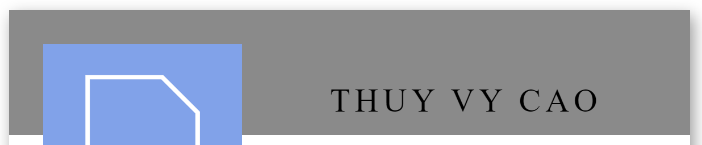
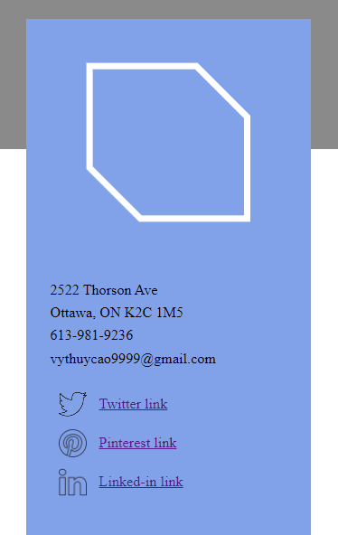
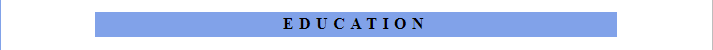
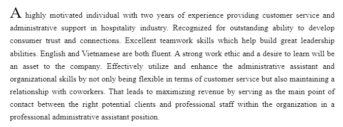

# Thuy Vy Cao's Portfolio Design System Documentation

This documentation provides a clear and simplified overview of the design system used for the portfolio project. It includes colors, typography, components, and layouts, along with screenshots of mock-ups for clear communication of the design.

## **1. Color Palette**
We use a simple and clear color palette throughout the design.

- **?Primary Color:** `#007BFF`
- **Text Color:** `#000`
- **?Border Color:** `#d888`
- **Background Color:** `#fff`
- **?Accent Color:** `#444`
- **Body Before Background Color:** `rgba(255,255,255,0.92)`

## **2. Typography**
- **Body Text:** `"Open Sans"`
- **Headers:** `'Raleway'`

## **3. Components and Layout**
### Header
- **Design:** Centered text with a grey background and black text.
- **Mock-up Screenshot:**

### Side-bar
- **Design:** Sky-blue background with black text, white logo, and social media links.
- **Mock-up Screenshot:**

| Icon | Links |
| ------ | ------ |
| Twitter | https://twitter.com/ |
| Pinterest | https://www.pinterest.ca/ |
| Linked-in | https://www.linkedin.com/feed/ |

### Title
- **Design:** White background with black text
- **Mock-up Screenshot:**

### Sub-title
- **Design:** Sky-blue background with black text
- **Mock-up Screenshot:**

### Content
- **Design:** Centered justified section with white background and black text. The first letter of the first paragraph is uppercase
- **Mock-up Screenshot:**

## **Conclusion**
This documentation serves as a concise reference guide for the design system used in the portfolio project, aiming to facilitate development and maintain consistency in design throughout the project.
